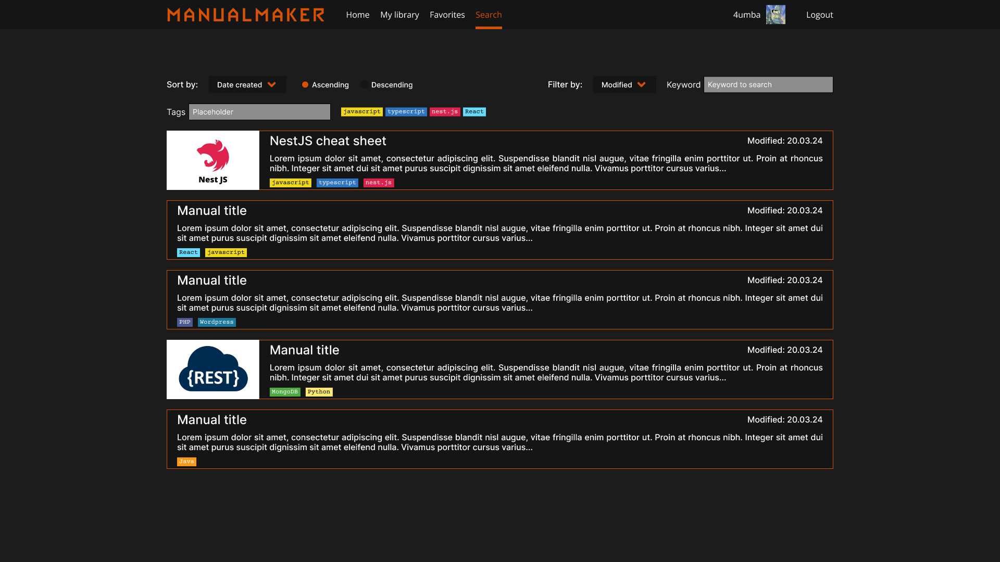
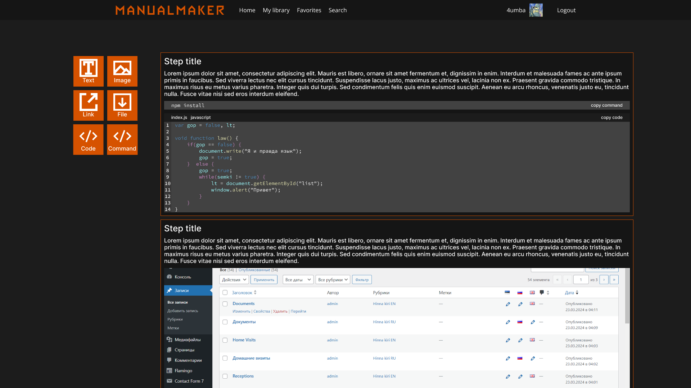

# ManualMaker Frontend
ManualMaker - сервис для создания подробных руководств на различные темы.

# Список технологий
1. React - JavaScript библиотека для создания пользовательских интерфейсов
2. Vite - сборщик приложения
3. TypeScript - язык программирования
4. Scss - css препроцессор

# Статус проекта: В разработке

# Как запускать
## Необходимое ПО
Для запуска проекта необходимо установить 
- [NodeJS](https://nodejs.org/en/download)
- [Git](https://git-scm.com/downloads)

## Клонировать проект
```
git clone https://github.com/DJDims/manualmaker-frontend
cd manualmaker-frontend
```

## Установить зависимости
Через pnpm
```
pnpm i
```

или npm
```
npm i
```

или yarn
```
yarn install
```

## Запустить
```
npm run dev
```

# Функционал







# Благодарности
- [Алексей Константинович Козлов](https://github.com/MiFista01) - за полезные советы и тестирование проекта
- [Юрий Валентинович Мельников](https://github.com/Dew25) - за полезные советы
